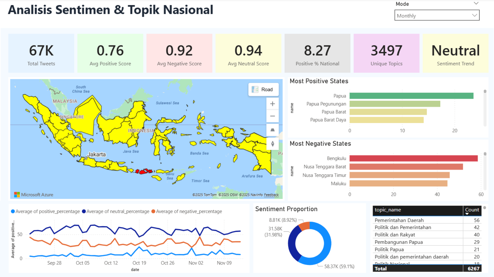

# 📊 Indonesian Public Sentiment & Topic Dashboard

**Power BI • Supabase PostgreSQL • Twitter Data**

---

## 📘 Overview

This project is a **visualization dashboard** for the main repository:
👉 **[https://github.com/Indonesian-Provincial-Sentiment-Tracker](https://github.com/Indonesian-Provincial-Sentiment-Tracker)**

The main repository handles **data collection, preprocessing, NLP sentiment analysis, topic extraction, and storage** into a Supabase PostgreSQL database.

**This Power BI dashboard is the visualization layer**, used to explore, analyze, and interpret the processed data interactively.

The dashboard is connected using **DirectQuery**, allowing it to show **real-time insights** from the database.

The dashboard shows:

* Sentiment (Positive, Negative, Neutral)
* Daily, Weekly, and Monthly trends
* Top topics and keywords
* State-level (province) insights
* Interactive map and filters

---

## 📸 Preview Dashboard

---

## 🛠️ Technology Used

| Purpose            | Tools                                       |
| ------------------ | ------------------------------------------- |
| Database           | Supabase PostgreSQL                         |
| BI & Visualization | Power BI (DirectQuery)                      |
| Data Source        | Twitter                                     |
| Visuals            | KPI Card, Map, Donut, Bar Chart, Line Chart |

---

## ⚡ Key Features

### ✔ Sentiment Analysis

* National sentiment overview
* State-level sentiment
* Daily/Weekly/Monthly averages
* Trend lines
* Top positive & negative states

### ✔ Topic Analysis

* Frequent topics
* Topic counts per province

### ✔ Interactive Visuals

* Map filter (click province to filter all visuals)
* Date slicer (daily / weekly / monthly)

